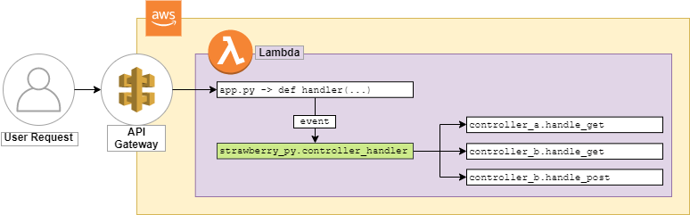

# strawberry-py

This framework is work in progress.

Aim is to avoid boilerplate WSGI layers when deploying python lambdas with multiple endpoints.
Frameworks like python-flask, connexion and others require developers to add an annoying wsgi layer on top of their api.
This casues the package to get bigger and bigger while also increasing the cold start times and runtime duration of a lambda.



## Support
- LightWeight, no dependencies
- Easy to use for people knowing .NET Core Rest Apis, Java Springboot Applications and similar
- Supports Python 3.7 and higher
- Supports AWS Lambda
- Should support other Lambda function providers with small adjustments.
- Comes with an OpenApi Generator for easing documentation of REST APIs ✨
- Supports automated parsing of application/json body in request and responses
- Supports seperating definition from implementation to ease handling of autogenerated code (e.g. OpenAPITools/Swagger)
- CamelCase parameter definitions are automatically converted to snake_cased names in python contexts. Just to meet the coding guidelines ❤
  ```python
  @query_string_parameter('myCamelCaseParam')
  def controller_method(self, my_camel_case_param):
    pass
  ```

# Setting up the main lambda python file
```python
from strawberry_py import ControllerHandler, AwsLambdaRequest, AwsLambdaResponse, HttpRequest, HttpResponse

#region Controllers
from my_api.controllers.hello_world_controller import HelloWorldController
#endregion

# AWS Handler, configured in Lambda
def handler(event, context) -> object:
  http_request = AwsLambdaRequest(event, context)
  http_response = handle_http_request(http_request)

  aws_lambda_response = AwsLambdaResponse.from_response(http_response)
  return aws_lambda_response.get_lambda_result()

# Generic Handler, called by aws or google handler
def handle_http_request(http_request: HttpRequest) -> HttpResponse:
  controller_handler = ControllerHandler.getinstance()
  http_response = controller_handler.handleRequest(http_request)
  return http_response

 ```

# Creating a controller
```python
from strawberry_py import controller, http_get, http_post, ControllerBase, path_parameter, query_string_parameter, body_parameter

@controller(HelloWorldController) # Tells ControllerHandler that this is a controller
class HelloWorldController(ControllerBase):

  def test_method(self):
    return

  @http_get('/hello/world/{firstName}/{lastName}') # Defines a routes
  @path_parameter('firstName', data_type=str, required=True) # Defines path parameter information
  @path_parameter('lastName', data_type=str, minimum_length=1)
  @query_string_parameter('greetInformal')
  def get_hello_world(self, first_name, last_name=None, greet_informal=False):
    greeting = 'Hello '
    if greet_informal:
      greeting = 'Yo, '
    return greeting + last_name + ', ' + first_name + '!'

  @http_post('/hello/world/{firstName}', body_argument='contact_info')
  @path_parameter('firstName')
  @body_parameter('contactInfo')
  def post_hello_world(self, first_name, contact_info):
    return  'Hello ' + contact_info['last_name'] + ', ' + first_name + '!'

```
